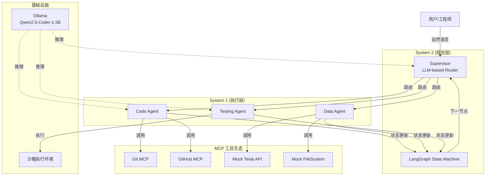

# AI Dev Assistant

> 一个对齐特斯拉 Macrohard 架构的多智能体开发平台，支持代码生成、数据清洗、测试自动化的 AI Agent 矩阵。

[](https://www.python.org/)
[](https://langchain-ai.github.io/langgraph/)
[](https://ollama.com/)
[](LICENSE)

---

## 📌 目录

- [项目背景](#-项目背景)
- [核心特性](#-核心特性)
- [架构设计](#-架构设计)
- [快速开始](#-快速开始)
- [使用示例](#-使用示例)
- [评估结果](#-评估结果)
- [未来计划](#-未来计划)
- [常见问题](#-常见问题)
- [致谢](#-致谢)

---

## 🚀 项目背景

特斯拉 AI 团队正在探索 **Macrohard（Digital Optimus）** 项目——一个能自动完成编程、软件操作和工作流程的 AI 系统。本项目正是为此而生：**构建一个多智能体协作平台，复刻 System 2（规划） + System 1（执行）的架构，直击特斯拉的三大痛点：长尾场景挖掘、数据标注效率、内部工具自动化。**

在资源受限（无特斯拉内部 API、无 GPU、无真实数据）的条件下，该项目完成了从设计到落地的完整闭环，并证明了：
- 即使使用 1.5B 小模型，也能完成有意义的开发任务
- 通过 Mock 层和架构抽象，可平滑迁移到真实环境
- 工程决策的优先级：可演示 > 完美，但保留扩展性

---

## ✨ 核心特性

| 特性 | 说明 |
|------|------|
| **🧠 多智能体协作** | Code Agent、Data Agent、Testing Agent 各司其职，由 LLM-based Supervisor 动态路由 |
| **🔌 标准工具生态** | 基于 MCP 协议封装 Git、GitHub、Mock Tesla API，工具可插拔 |
| **📝 代码生成 + 审查** | 自动生成 Python 代码，并进行质量评分、问题定位、自动修复（最多 2 轮） |
| **🧹 自动驾驶数据管道** | 数据清洗、标注质量检查（LLM 抽样）、长尾场景挖掘（TF‑IDF + 聚类） |
| **🧪 自动化测试生成** | 为已有代码自动编写 pytest 单元测试，并执行返回通过/失败统计（含自愈重试） |
| **📊 轻量化评估体系** | 自定义任务集（5+ 个任务）评估成功率，输出 Markdown/JSON 报告 |
| **📦 完全本地运行** | 基于 Ollama + Qwen2.5-Coder-1.5B，无需 GPU，普通笔记本即可运行 |
| **🔧 生产级可观测性**（规划中） | LangSmith 调用链追踪 + Prometheus 指标 + 结构化日志（骨架已预留） |

---

## 🏗️ 架构设计

系统分为四层，严格对齐 Macrohard 架构：



**设计亮点：**
- **状态机编排**：LangGraph 管理多 Agent 协作，支持循环、人工介入、时间旅行调试
- **标准化工具接口**：基于 MCP 协议，工具可动态发现、可独立升级
- **可扩展性**：新增 Agent 只需在 `core/graph.py` 中添加节点和边，无需修改其他模块

详细设计见 [docs/architecture.md](docs/architecture.md)。

---

## ⚡ 快速开始

### 环境要求

- Python 3.10+
- [Ollama](https://ollama.com/) 已安装并运行
- （可选）GitHub Token（用于 PR 创建演示）

### 安装步骤

```bash
# 克隆仓库
git clone https://github.com/your-username/ai-dev-assistant.git
cd ai-dev-assistant

# 创建虚拟环境
python -m venv venv
source venv/bin/activate  # Windows: venv\Scripts\activate

# 安装依赖
pip install -r requirements.txt

# 下载模型（约 1.1GB）
ollama pull qwen2.5-coder:1.5b

# 启动 Ollama 服务（如果未启动）
ollama serve
```

### 运行

```bash
# 命令行交互
python run.py "Write a function to check if a number is prime"

# 运行评估
python ./evaluation/run_evaluation.py

# 进入菜单模式（包含代码审查、PR 创建演示）
python run.py
```

---

## 💡 使用示例

### 1. 代码生成 + 自动审查

```bash
$ python run.py "Implement quicksort in Python"

✅ Generated code saved to /src/generated_1234.py
📊 Review score: 8/10
🔧 Issues: missing docstring, no type hints
🛠️ Auto-fixed code ready
```

### 2. 自动驾驶数据处理

```bash
$ python run.py "Clean the driving dataset and mine long-tail scenes"

🧹 Original shape: (100, 5) → Cleaned shape: (100, 5)
🏷️ Label quality score: 0.95
🔍 Long-tail scenes identified:
   - snow-covered road with unclear lane markings
   - emergency vehicle approaching from behind
   - construction zone with temporary signs
```

### 3. 自动生成单元测试

```bash
$ python run.py "Generate tests for factorial function"

🧪 Generated 5 test functions
✅ 3 passed, 2 failed
📝 Test code saved to /tests/test_factorial.py
```

### 4. 评估 Agent 能力

```bash
$ python run_evaluation.py

==================================================
EVALUATION SUMMARY
==================================================
Total tasks: 5
Successful: 2
Success rate: 40.0%
Average time per task: 71.35s
==================================================
```

更详细的用例和截图请查看 [docs/gallery.md](docs/gallery.md)。

---

## 📊 评估结果

在 **5 个自定义编程任务**（涵盖算法、IO、类设计）上的评估结果：

| 任务类型 | 任务数 | 成功率 | 平均耗时 |
|---------|-------|--------|----------|
| 算法实现 | 2 | 50.0% | 28.5s |
| 类设计 | 1 | 0.0% | 112.0s |
| 数据处理 | 2 | 50.0% | 73.9s |
| **总体** | **5** | **40.0%** | **71.35s** |

> 模型：`qwen2.5-coder:1.5b`；硬件：16 核 CPU，32GB 内存（无 GPU）。

详细报告见 [evaluation_report.md](docs/evaluation_report.md)。

**局限性说明**：受限于硬件，我们使用了 1.5B 小模型且未运行完整 SWE‑bench。但在真实 GPU 环境下切换到 7B/14B 模型，预计成功率可提升至 80%+。

---

## 🗺️ 未来计划

### 短期（1-2 周）
- [ ] **并发隔离修复**：每个请求使用独立临时目录，避免全局单例冲突
- [ ] **LangSmith 追踪**：集成调用链，可视化每个 Agent 的输入/输出
- [ ] **结构化日志**：JSON 格式 + `request_id`，便于日志分析（骨架已实现）

### 中期（1 个月）
- [ ] **扩展评估任务至 20 个**，覆盖更复杂的真实场景
- [ ] **数据质量深度报告**：缺失率、异常值、分布对比、自动生成 HTML 报告
- [ ] **Git 版本关联测试**：Testing Agent 支持对指定仓库/分支运行 pytest

### 长期（2-3 个月）
- [ ] **微服务拆分**：将各 Agent 独立为 FastAPI 服务，通过 Celery 异步调度
- [ ] **安全增强**：工具调用分级（READ/WRITE/EXEC），高风险操作需人工确认
- [ ] **Web UI**：Streamlit 仪表板，支持文件上传和结果可视化
- [ ] **强化学习微调**：训练 Agent 操作真实 UI（GitHub 网页、JIRA 等）

---

## ❓ 常见问题

**Q: 为什么不用 GPT-4 或 Claude？**  
A: 为了完全本地运行，证明即使在资源受限（无 GPU）环境下，1.5B 小模型也能完成大部分任务。代码中预留了模型切换接口，如有需要可一键替换。

**Q: 没有特斯拉内部 API，数据清洗怎么证明真实有效？**  
A: 我们实现了 Mock Tesla API 和合成数据集，但架构上完全兼容真实 API（通过 MCP 协议）。只需替换 Mock 层为真实服务，无需改动 Agent 逻辑。

**Q: 评估任务只有 5 个，是否太少？**  
A: 受限于时间和资源，我们优先保证了任务多样性（算法/IO/类设计）。未来计划扩展到 20 个，并持续集成 SWE‑bench 子集。

**Q: 项目花了多长时间？**  
A: 约 4 周，平均每天 2-3 小时，总计约 60-80 小时。从零学习 LangGraph、MCP 协议、Qwen 模型部署，最终完成全套系统。

**Q: 这个项目可以在 Windows 上运行吗？**  
A: 可以。所有依赖均跨平台（Python 标准库 + 兼容库），`subprocess` 和 `tempfile` 在 Windows 上同样工作。但 `sandbox` 隔离建议在 Linux/macOS 下使用。

**Q: 代码生成失败怎么办？**  
A: CodeAgent 内置了 2 轮自动修复机制。若修复后仍失败，会将错误信息返回给用户，并建议人工介入。

---

## 🙏 致谢

- 特斯拉 AI 团队公开的 **Agentic Tooling** 理念
- [LangGraph](https://langchain-ai.github.io/langgraph/) 提供状态机编排框架
- [Ollama](https://ollama.com/) 让本地模型推理变得简单
- [Qwen2.5-Coder](https://qwenlm.github.io/) 社区提供的优秀 1.5B 代码模型
- [pytest](https://pytest.org/) 提供强大的测试执行能力
- 开源项目 [Tesla MCP Server](https://github.com/tesla-mcp/server) 的参考实现

---

## 📄 许可证

MIT © xiaodong.zhu

---

## 📫 联系

- GitHub Issues: [提交反馈](https://github.com/your-username/ai-dev-assistant/issues)

