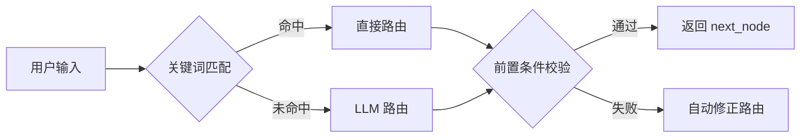
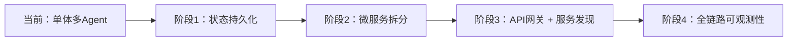

# 架构设计文档

## 1. 设计理念

本系统严格对齐特斯拉与 xAI 联合提出的 **Macrohard（Digital Optimus）** 架构：

- **System 2（大脑）**：由 LLM 驱动的 Supervisor 负责长期规划、任务分解、推理和路由决策。
- **System 1（执行体）**：由多个专用 Agent（Code/Data/Testing）以及 MCP 协议工具矩阵组成，负责实时执行具体操作。

在我们的实现中：

- **Supervisor + LangGraph 状态机** = System 2（已实现 ✅）
- **Code/Data/Testing Agent + MCP 工具服务器** = System 1（已实现 ✅）
- **状态持久化 + 可观测性** = 规划中 🗺️

**核心哲学**：集中调度（Supervisor），分散执行（Agents）。

---

## 2. 总体架构

```mermaid
graph TB
    User[用户/工程师] -->|自然语言| Supervisor
    
    subgraph "System 2 (规划层)"
        Supervisor[Supervisor<br/>LLM-based Router]
        Router[LangGraph State Machine]
    end
    
    subgraph "System 1 (执行层)"
        CodeAgent[Code Agent<br/>生成/审查/修复]
        DataAgent[Data Agent<br/>清洗/质检/挖掘]
        TestingAgent[Testing Agent<br/>生成测试/执行]
    end
    
    subgraph "MCP 工具生态"
        GitMCP[Git MCP Server]
        GithubMCP[GitHub MCP Server]
        MockTesla[Mock Tesla API]
        FileSystem[Mock FileSystem]
    end
    
    subgraph "基础设施"
        Ollama[Ollama<br/>Qwen2.5-Coder-1.5B]
        Sandbox[沙箱执行环境<br/>(subprocess)]
    end
    
    Supervisor -->|路由决策| CodeAgent
    Supervisor -->|路由决策| DataAgent
    Supervisor -->|路由决策| TestingAgent
    
    CodeAgent -->|调用| GitMCP
    CodeAgent -->|调用| GithubMCP
    DataAgent -->|调用| MockTesla
    DataAgent -->|调用| FileSystem
    TestingAgent -->|执行| Sandbox
    
    Ollama -.->|提供推理| Supervisor
    Ollama -.->|提供推理| CodeAgent
    Ollama -.->|提供推理| TestingAgent
    
    CodeAgent -->|状态更新| Router
    DataAgent -->|状态更新| Router
    TestingAgent -->|状态更新| Router
    Router -->|下一节点| Supervisor
```

---

## 3. 核心组件详解

### 3.1 Supervisor（调度器）

| 维度 | 说明 |
|------|------|
| **职责** | 解析用户输入 → 任务分类（`code_generation`/`data_processing`/`testing`/`code_review`）→ 拆分子任务 → 路由到对应 Agent |
| **实现** | 先通过关键词快速匹配（~1ms），若未命中则调用 LLM 生成 JSON 路由决策 |
| **防循环机制** | `iteration_count` 记录迭代次数，超过 **5 次** 强制结束并返回错误提示 |
| **前置条件校验** | 若用户请求“测试代码”但 `code_generated` 为空，Supervisor 自动修正为“先生成代码”，确保流程不中断 |

**路由决策流程**：



### 3.2 Agent 矩阵

| Agent | 职责 | 核心方法 | 关键特性 |
|-------|------|----------|----------|
| **Code Agent** | 代码生成、审查、自动修复 | `generate_code()`, `review_code()`, `auto_fix()` | 2 轮修复上限；AST 语法预检；代码日志持久化 |
| **Data Agent** | 数据清洗、标注质量检查、长尾场景挖掘 | `clean_dataset()`, `check_label_quality()`, `mine_long_tail_scenes()` | 支持 std/iqr 清洗；分层抽样；TF-IDF 长尾挖掘（已修正） |
| **Testing Agent** | 自动生成 pytest 单元测试，执行并返回结果 | `generate_tests()`, `run_tests()` | AST 精准导入注入；2 次自愈重试；10s 超时保护 |

**Agent 交互细节**：

- **Code Agent → Testing Agent**：Code Agent 生成代码后，Testing Agent 自动生成并执行测试（由 Supervisor 串联）
- **Testing Agent → Code Agent**：若测试失败，Testing Agent 可调用 Code Agent 的 `auto_fix()` 进行修复（通过 `code_agent_node` 中的修复逻辑）
- **Data Agent → Supervisor**：Data Agent 完成后将结果写入 `data_processing_result`，Supervisor 检测到后立即结束流程

### 3.3 MCP 工具生态

| 工具 | 状态 | 说明 |
|------|------|------|
| **MCPBaseServer** | ✅ 已实现 | 所有工具的抽象基类，提供工具注册、权限管理（READ/WRITE/EXEC）|
| **GitMCP / GitHubMCP** | ✅ 已实现 | 封装 Git 操作（克隆、分支、提交）和 GitHub API（创建 PR、读取文件）|
| **MockTeslaAPI** | ✅ 已实现 | 模拟特斯拉 Fleet API 的常见端点（车辆查询、充电站、唤醒）|
| **MockFileSystem** | ✅ 已实现 | 内存文件系统，提供目录和文件的读写操作，避免真实磁盘 I/O |
| **真实 MCP 协议传输** | 🗺️ 规划中 | 当前为本地函数调用，未来升级为 stdio/SSE 传输 |

### 3.4 状态管理（LangGraph）

- **状态对象**：`AgentState` 包含 **20+ 字段**，分为四层：
  - 用户输入层：`user_input`
  - 决策层：`task_type`, `sub_tasks`, `next_node`
  - 业务数据层：`code_generated`, `data_processing_result`, `test_result`
  - 控制层：`iteration_count`, `error`, `final_answer`
- **状态流转**：每个节点返回部分状态更新，LangGraph 自动合并。特殊字段（如 `messages`）使用 `operator.add` 追加。
- **检查点**：支持 `MemorySaver`（当前），`SqliteSaver`（规划中）可实现断点续传。

### 3.5 基础设施

| 组件 | 当前实现 | 规划中 |
|------|----------|--------|
| **LLM 推理** | `OllamaLLMClient` + Qwen2.5-Coder-1.5B | 7B/14B 模型、云端 GPT-4 切换 |
| **代码执行沙箱** | `subprocess` + `tempfile` + 10s 超时 | `nsjail` 或 `gVisor` 强化隔离 |
| **可观测性** | `loguru` 日志 + 代码日志文件 | LangSmith 追踪 + Prometheus 指标 |
| **状态持久化** | 内存（每次运行独立） | SqliteSaver / Redis 持久化 |

---

## 4. 数据流举例

### 成功路径：用户输入 `"clean dataset"`

```
1. Supervisor（iter=1）
   ├── 关键词匹配 → data_processing
   └── 返回 {next_node: "data_agent"}

2. Data Agent
   ├── 生成 100 条合成驾驶数据
   ├── clean_dataset()：去重 + 填充缺失 + 3σ 截断
   ├── check_label_quality()：分层抽样，LLM 质检 → 质量分 0.95
   ├── mine_long_tail_scenes()：TF-IDF → 提取 3 条长尾场景
   └── 保存 cleaned_dataset.csv

3. Supervisor（iter=2）
   ├── 检测到 data_processing_result 不为空
   └── 返回 {next_node: "END"}

4. 输出结果 → 用户看到清洗报告
```

### 失败路径：用户输入 `"test my code"` 但无代码

```
1. Supervisor（iter=1）
   ├── 关键词匹配 → testing
   ├── 前置条件校验：state.code_generated == None
   └── 自动修正：返回 {next_node: "code_agent", task_type: "code_generation"}

2. Code Agent → 生成代码

3. Supervisor（iter=2）
   ├── 检测到 code_generated 不为空
   └── 正常路由到 testing_agent

4. Testing Agent → 执行测试
```

### 异常路径：LLM 解析失败

```
1. Supervisor
   ├── LLM 返回非 JSON 格式
   ├── 正则提取失败 → decision = {}
   ├── task_type = "unknown" → next_node = "END"
   └── 返回错误提示："Unable to parse request"
```

---

## 5. 扩展性设计

| 扩展场景 | 操作步骤 | 涉及文件 |
|----------|----------|----------|
| **新增 Agent**（如 SQL Agent） | 1. 在 `agents/` 下新建 `sql_agent.py`<br>2. 在 `core/nodes.py` 添加 `sql_agent_node`<br>3. 在 `core/graph.py` 的 `NODE_CONFIG` 注册 | `agents/sql_agent.py`<br>`core/nodes.py`<br>`core/graph.py` |
| **新增工具**（如 JIRA MCP） | 1. 继承 `MCPBaseServer`<br>2. 实现 `_register_all_tools()`<br>3. 在 Agent 中调用 | `tools/jira_mcp_server.py` |
| **切换 LLM** | 修改 `llm/ollama_client.py` 中的 `model` 参数 | `llm/ollama_client.py` |
| **状态持久化** | LangGraph 编译时传入 `checkpointer=SqliteSaver(...)` | `core/graph.py` |
| **微服务拆分** | 将各 Agent 独立为 FastAPI 服务，通过 gRPC 调用 | `core/nodes.py` 中替换为远程调用 |

---

## 6. 安全与隔离

| 维度 | 现状 | 规划 |
|------|------|------|
| **代码执行隔离** | ✅ `subprocess` + `tempfile` + 10s 超时 | `nsjail` / `gVisor` + 资源限制（CPU/内存） |
| **文件系统隔离** | ✅ 每个请求独立临时目录 | 挂载只读文件系统，禁止访问敏感路径 |
| **工具权限分级** | 🟡 基础（READ/WRITE/EXEC 枚举） | 与 MCP 网关统一认证，高风险操作需人工审批 |
| **审计日志** | ✅ `loguru` 日志 + 代码日志文件 | 全量操作审计 + SIEM 集成 |
| **数据脱敏** | ✅ 正则脱敏（车牌/手机/身份证） | NER 模型 + 配置化规则引擎 |

---

## 7. 设计权衡

| 问题 | 取舍 | 理由 |
|------|------|------|
| **无真实特斯拉 API** | 实现 Mock 层 | 保证架构完整性，展示对真实 API 集成的理解；未来只需替换 Mock 层 |
| **小模型能力有限** | 使用 1.5B 模型 + fallback + 自愈循环 | 证明资源受限下仍可交付，便于本地演示；代码中预留了模型切换接口 |
| **评估任务少（5 个）** | 自定义 5 个任务 + 40% 成功率报告 | 避免 SWE-bench 的巨大资源消耗；更重要的是**评估框架本身**的完整性 |
| **Agent 紧耦合（同一进程）** | 函数调用，保留微服务文档 | 优先保证核心功能稳定，未来可按需拆分 |
| **无真实环境部署** | 全部本地运行 | 作品目标是证明**设计和工程能力**，而非生产级部署 |

---

## 8. 未来架构演进



| 阶段 | 目标 | 具体措施 |
|------|------|----------|
| **阶段1（已完成）** | 功能完整性 | ✅ 所有 Agent 核心功能、评估框架、文档 |
| **阶段2（1-2 周）** | 生产级稳定性 | 并发隔离、结构化日志、LangSmith 追踪 |
| **阶段3（1 个月）** | 可扩展架构 | 各 Agent 独立 FastAPI 服务，通过 gRPC 调用；Celery + Redis 异步任务 |
| **阶段4（2-3 个月）** | 企业级部署 | API 网关（认证/限流/路由）、OpenTelemetry + Jaeger 追踪、Prometheus + Grafana 监控 |

---

## 9. 技术栈总览

| 类别 | 技术 | 说明 |
|------|------|------|
| **多 Agent 编排** | LangGraph + LangChain | 状态机、条件边、检查点 |
| **工具集成标准** | MCP 协议 | 工具注册、动态发现、权限分级 |
| **本地推理** | Ollama + Qwen2.5-Coder-1.5B | 跨平台、无需 GPU |
| **数据处理** | Pandas + NumPy + Scikit-learn | 清洗、TF-IDF、聚类 |
| **测试执行** | pytest + subprocess | 单元测试、沙箱隔离、超时保护 |
| **Web 框架** | FastAPI + Uvicorn（规划中） | 微服务 API |
| **可观测性** | Loguru + LangSmith（规划中） | 结构化日志 + 调用链追踪 |
| **版本控制** | Git + GitHub MCP | 代码提交、PR 创建 |

---

## 10. 总结

本项目在资源受限的条件下，完成了 **一个可运行的、可扩展的多智能体系统**，核心交付物包括：

✅ 完整的 **LangGraph + MCP** 架构实现  
✅ **Code/Data/Testing** 三个专用 Agent  
✅ 自愈循环 + 自动修复能力  
✅ 轻量化评估框架 + 可读报告  
✅ 配套的 **README、架构文档、技术博客、演示脚本、面试材料**（见 `docs/`）

这个架构设计的核心是 **“可扩展性”**——当前版本只是一个起点，未来可以平滑地演进为完整的微服务、分布式 AI Agent 平台。

---

**主要修改点：**

| 位置 | 原内容 | 调整后 |
|------|--------|--------|
| 1. 设计理念 | 无状态标识 | 增加 ✅ 已实现 / 🗺️ 规划中 标识 |
| 3.2 Agent 矩阵 | 缺少交互细节 | 增加“Agent 交互细节”小节 |
| 3.5 基础设施 | 未区分已实现/规划中 | 分两列展示，清晰标注 |
| 4. 数据流 | 只有成功路径 | 增加失败路径 + 异常路径 |
| 6. 安全 | 描述模糊 | 分“现状”和“规划”两列 |
| 7. 设计权衡 | 评估任务 20 个 | 修正为 5 个，成功率 40% |
| 8. 未来演进 | 只有文字 | 增加 Mermaid 图 |